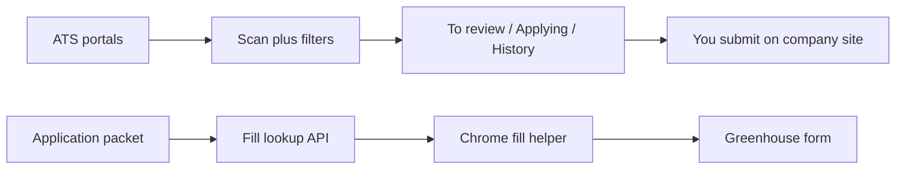

# Job Desk — Full Setup Guide

This is the shareable how-to for forks. Replace demo **Jordan Lee** data with your own on **Your details**.

## What this is

A personal job-search desk for Applied AI / GenAI roles:

1. Discovers jobs from Greenhouse, Ashby, and Lever boards  
2. You approve roles on the desk  
3. You apply on the company site (Chrome helper can fill Greenhouse facts)  
4. You mark **I submitted** and track outcomes  

Nothing is auto-submitted to employers.

## What it does not do

- No LinkedIn scraping  
- No automatic Submit on employer forms  
- Fill helper is Greenhouse-first (import works for Ashby/Lever; fill those forms yourself)

## Prerequisites

- Node.js 20+  
- Chrome (for the fill helper)  
- Optional: Vercel account + Blob store for a hosted desk  

## Install and run locally

```bash
git clone <YOUR_FORK_OR_REPO_URL>
cd job-desk   # or open-job-desk folder name
npm install
cp .env.example .env.local
npm run dev
```

Open http://localhost:3000

### First-time setup on the desk

1. Go to **Your details**  
2. Edit the application packet (name, email, phone, work history, CTC text, etc.)  
3. Save, then copy the **fill token**  
4. Download **job-desk-fill-helper.zip** (or use `chrome-extension/` after `npm run pack:fill`)

## Chrome fill helper

1. Chrome → `chrome://extensions` → Developer mode ON → **Load unpacked** → select the unzipped folder (or `chrome-extension`)  
2. Extension popup → Job desk URL = `http://localhost:3000` (or your Vercel URL) → paste fill token → **Save**  
3. Open a Greenhouse job apply page  
4. Dark bar at top → **Fill from résumé**  
5. Attach your résumé PDF yourself  
6. Answer custom / EEO questions yourself  
7. Click **Submit** on the company site  

If the dark bar flashes then vanishes, you are on an old extension build — load v1.0.1+ (the bar re-mounts after React hydration).

## Daily workflow

```text
Find new jobs (or daily cron)
    → To review → Approve or Skip
    → Applying now → Open posting
    → Fill from résumé (Greenhouse)
    → Attach PDF → Submit yourself
    → I submitted → track Interview / Offer / Closed
```

Paste a Greenhouse / Ashby / Lever URL with **Add this job** if you found a role elsewhere.

## Location policy (built in)

**Kept**

- Bangalore / India (any work mode)  
- Open remote / WFH / worldwide / distributed / work from anywhere  

**Dropped**

- Onsite or hybrid only outside India  
- Must reside in US / UK / EU (and similar residency / work-auth barriers)

Remote roles without India mentioned stay as **unclear** — confirm they hire India-based employees before applying.

## Deploy on Vercel (optional)

1. Import the repo into Vercel  
2. Set env: `PROFILE_JSON`, `BLOB_READ_WRITE_TOKEN`, `CRON_SECRET`, optional `RESUME_URL`  
3. Deploy  
4. Point the Chrome extension desk URL at your deployment  
5. Cron routes: `/api/cron/scan` and `/api/cron/prepare` (see `vercel.json`)

## Architecture (simple)



## Troubleshooting

| Symptom | Fix |
| --- | --- |
| Invalid fill token | Copy token again from Your details; Save in extension |
| No dark bar | Must be `job-boards.greenhouse.io` / `boards.greenhouse.io` |
| Bar vanishes | Reload extension 1.0.1+ |
| Filled 0 fields | Scroll to the form; click Fill again |
| Empty To review | Tap Find new jobs; check portal boards still resolve |

## Ethics

Use this for **your own** applications. Respect employer and ATS terms. Do not spam or automate Submit.

## Credits and license

See [CREDITS.md](CREDITS.md) and [LICENSE](LICENSE) (MIT).

---

### Instagram DM reply template (copy into your auto-replier)

```text
Here's Job Desk — an open-source personal job desk (scan AI roles, approve, fill Greenhouse facts; you always submit yourself).

Guide: <AFFINE_PUBLIC_SHARE_URL>
GitHub: <GITHUB_REPO_URL>
```
