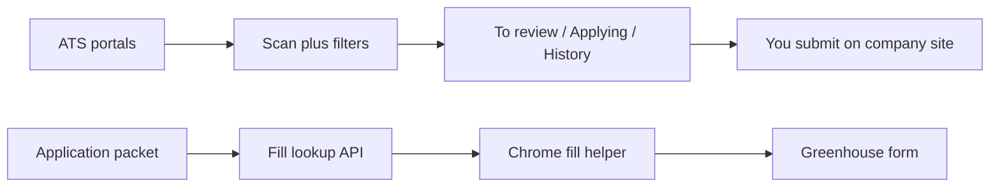

# Job Desk — Full Setup Guide

This is the shareable how-to for forks. Replace demo **Jordan Lee** data with your own on **Your details**.

## Friendly guide (for everyone)

Plain-language walkthrough (any sector, non-technical steps):  
https://saket-affine.duckdns.org/guides/job-desk/

Editable Page twin:  
https://saket-affine.duckdns.org/workspace/9ad0bc25-ba8b-493e-a5fb-cd2fdfeb7cf7/UZA8pYVa8tFTrKF0a6ymo?mode=page

Source of truth: [`AFFINE-PAGE-GUIDE.md`](./AFFINE-PAGE-GUIDE.md).

## What this is

A personal job-search desk for **any sector** (demo defaults: Applied AI + India / open remote):

1. Discovers jobs from Greenhouse, Ashby, and Lever boards  
2. You review on **To review** → **Applying now** → **History**  
3. Green / amber skill pills show résumé matches vs JD asks  
4. You apply on the company site (Chrome helper can fill Greenhouse facts)  
5. You mark **I submitted** and track outcomes  

Nothing is auto-submitted. Change skills, titles, geo rules, and boards on **Your details**.

## What it does not do

- No LinkedIn scraping  
- No automatic Submit on employer forms  
- Fill helper is Greenhouse-first (import works for Ashby/Lever; fill those forms yourself)

## Prerequisites

- Node.js 20+ (ask a friend if needed — one-time)  
- Chrome (for the fill helper)  
- Optional: Vercel account + Blob store for a hosted desk  

After clone, open **Your details** to replace the Jordan Lee demo, set targeting for your sector/locations, upload a résumé PDF, and copy the fill token. Use **Force add** when pasting a job URL that discovery would otherwise filter.

## Install and run locally

```bash
git clone https://github.com/saket-builds/open-job-desk.git
cd open-job-desk
npm install
cp .env.example .env.local
npm run dev
```

Open http://localhost:3000

### First-time setup on the desk

1. Go to **Your details**  
2. Edit **Candidate facts** + **Targeting** (skills, open-title mode, home markets, boards) and save  
3. Upload your résumé PDF  
4. Edit the application packet and save  
5. Copy the **fill token**  
6. Download **job-desk-fill-helper.zip** (or use `chrome-extension/` after `npm run pack:fill`)

Optional seed: minify [`docs/profile.sample.json`](./profile.sample.json) into `PROFILE_JSON` in `.env.local`.

## Chrome fill helper

1. Chrome → `chrome://extensions` → Developer mode ON → **Load unpacked** → select the unzipped folder (or `chrome-extension`)  
2. Extension popup → Job desk URL = `http://localhost:3000` (or your Vercel URL) → paste fill token → **Save**  
3. Open a Greenhouse job apply page  
4. Dark bar at top → **Fill from résumé**  
5. Attach your résumé PDF yourself  
6. Answer custom / EEO questions yourself  
7. Click **Submit** on the company site  

If the dark bar flashes then vanishes, you are on an old extension build — load v1.0.1+ (the bar re-mounts after React hydration).

## Daily workflow

```text
Find new jobs (or daily cron)
    → To review (read green/amber pills) → Approve or Skip
    → Applying now → Open posting
    → Fill from résumé (Greenhouse)
    → Attach PDF → Submit yourself
    → I submitted → track Interview / Offer / Closed
```

Paste a Greenhouse / Ashby / Lever URL with **Add this job**. Check **Force add** to bypass title/geo discovery filters (still scores; low scores go to review).

## Location policy (demo defaults)

Demo defaults keep Bangalore / India and open-remote; change **home location patterns** and related flags on **Your details** for your markets.

**Kept (with demo defaults)**

- Bangalore / India (any work mode)  
- Open remote / WFH / worldwide / distributed / work from anywhere  

**Dropped (with demo defaults)**

- Onsite or hybrid only outside India  
- Must reside in US / UK / EU (and similar residency / work-auth barriers)

Remote roles without your home markets mentioned stay as **unclear** — confirm they hire for your locations before applying.

## Deploy on Vercel (optional)

1. Import the repo into Vercel  
2. Set env: `BLOB_READ_WRITE_TOKEN`, `CRON_SECRET` (required), optional `PROFILE_JSON` / `RESUME_URL`  
3. Deploy — keep the URL private or put access control in front; APIs have no login  
4. Point the Chrome extension desk URL at your deployment  
5. Cron routes: `/api/cron/scan` and `/api/cron/prepare` (see `vercel.json`)

## Architecture (simple)



## Troubleshooting

| Symptom | Fix |
| --- | --- |
| Invalid fill token | Copy token again from Your details; Save in extension |
| No dark bar | Must be `job-boards.greenhouse.io` / `boards.greenhouse.io` |
| Bar vanishes | Reload extension 1.0.1+ |
| Filled 0 fields | Scroll to the form; click Fill again |
| Empty To review | Tap Find new jobs; check targeting / Force add |

## Ethics

Use this for **your own** applications. Respect employer and ATS terms. Do not spam or automate Submit.

## Credits and license

See [CREDITS.md](CREDITS.md) and [LICENSE](LICENSE) (MIT).

### Share blurb

```text
Here's Job Desk — a personal board for any job sector. Find roles, approve the ones you like, and fill Greenhouse forms faster. You always submit yourself.

Guide: https://saket-affine.duckdns.org/guides/job-desk/
GitHub: https://github.com/saket-builds/open-job-desk
```
